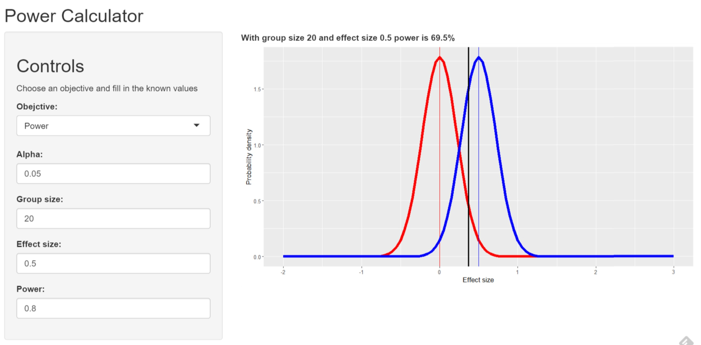

```{r, warning=FALSE,message=FALSE,results='hide', echo=FALSE}
source("pres.R")
```

## Power is hard

* Often, study designers hope to see an effect
* Thinking about _not_ finding it is unntuitive
* Can lead to wasted studies
* Usually, people need to work backwards from a conventional power (80%)

---

## Make it easier

* Concentrate on key use cases ("objectives"):
  + Find the group size you need to achieve a given power supposing an effect size
  + Find the effect size you can detect at a given power with a given group size
  + Find the power you have supposing an effect size for a given group size 
* Present delta as _effect size_ so that interface is unit-free
* Provide a visualisation alongside the calculation

---

## Simple visualisation

* Thanks to Brian Caffo 
  ++ Null hypothesis curve in <span style="color: red;">red</span>
  ++ Alternative hypothesis curve in <span style="color: blue;">blue</span>
* Visualisation actually shows Z-test, but calculate results from power.t.test
* Effect size (x-axis) 0.5, and group size 20, with alpha 0.05

```{r simplevis, echo=FALSE, fig.height=5, fig.width=8, fig.align='center'}
pow_plot(effect_size=0.5, n=20, alpha=0.05, objective="Power")
```

--- img.max-width: 90%

## How it looks

Try it at [shinyapps.io](https://philallen117.shinyapps.io/coursera-data-products/)



---

## Enhancements backlog

* Conditional hiding of input controls depending on objective
 ++ Using customer HTML
* Support other forms of test besides 1-sided, 1-sample
* Turn alpha, power inputs into percentages

